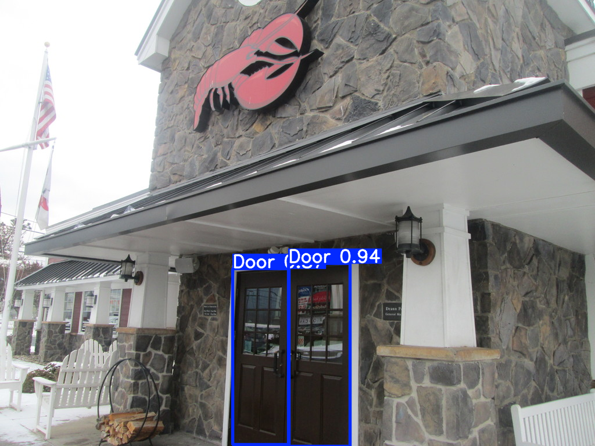

# VisionBridge — Door Detection



Single-class door detection pipeline that merges multiple YOLO-format datasets into one and fine-tunes YOLOv8.

## Features
- Merge multiple YOLO datasets keeping only the "door" class
- Optional duplicate-image filtering via perceptual hashing (aHash)
- Fine-tune YOLOv8 with configurable training overrides
- Quick prediction script that saves an example output (`pred.png`)

## Requirements
- Linux, bash
- Python 3.12+
- [uv](https://docs.astral.sh/uv/) for fast dependency and venv management
- GPU optional but recommended (CUDA setup for PyTorch if available)

## Quick start (recommended: uv)

1) Install uv

```bash
curl -LsSf https://astral.sh/uv/install.sh | sh
# then open a new shell or: source ~/.local/share/uv/init.sh
```

2) Create a virtual environment and install dependencies

```bash
# From repository root
uv venv .venv
source .venv/bin/activate
uv sync
```

This uses `pyproject.toml` and `uv.lock` to install pinned dependencies (Ultralytics, OpenCV, NumPy, FiftyOne, etc.).

3) Prepare datasets

Place your YOLO-format datasets under `dataset/`, each with:

```
<DATASET_NAME>/
  images/
    train/
    val/
  labels/
    train/
    val/
  dataset.yaml
```

Out of the box, the project contains:
- `dataset/DoorDetect_yolo_training`
- `dataset/VIDD`

You can add more datasets and then list them in `src/scripts/main.py` under `DATASETS`.

## Training (merge + fine-tune)

`main.py` will:
- Merge datasets, keeping only class "door" (reindexed to class `0`)
- Optionally skip duplicate images (controlled by `DEDUPLICATE`)
- Write merged dataset to `dataset/Doors_Merged` with a single-class `dataset.yaml`
- Fine-tune YOLOv8 using `src/scripts/multi_dataset.yaml` overrides

Run training:

```bash
uv run python src/scripts/main.py
```

Options:
- Base model: set the environment variable `YOLO_BASE` to point to weights (default `yolov8s.pt`)

```bash
export YOLO_BASE=yolov8n.pt   # or a local .pt path
uv run python src/scripts/main.py
```

- To add datasets: edit `DATASETS` in `src/scripts/main.py`
- To control duplicates: adjust `DEDUPLICATE` and `REPORT_DUPLICATES` in `src/scripts/main.py`

Training outputs and best weights are saved under Ultralytics runs, e.g. `src/scripts/runs/detect/.../weights/best.pt`.

## Predictions

Use `src/scripts/predictions.py` to run quick predictions and save a sample visualization to `pred.png`.

```bash
uv run python src/scripts/predictions.py
```

By default it:
- Loads the latest fine-tuned weights from `scripts/runs/detect/multi_dataset/weights/best.pt`
- Reads images from `dataset/Doors_Merged/images/val`
- Displays detections and writes `pred.png`

You can change the `model_path` and `test_images_dir` at the top of `src/scripts/predictions.py`.

## Alternative setup (standard Python venv)

If you prefer not to use `uv`:

```bash
python3.12 -m venv .venv
source .venv/bin/activate
pip install -U pip
pip install -e .
```

Note: This path installs the latest compatible versions from `pyproject.toml` but does not use the exact pins in `uv.lock`.

## Tips
- CUDA: If using GPU, ensure your PyTorch + CUDA versions match your system. Ultralytics will use the installed PyTorch.
- Datasets: Only the "door" class is retained; all other classes are filtered out during merge.
- Negatives: Images without any doors are kept as negatives when `INCLUDE_NEGATIVES=True`.

## Repository structure (key paths)
- `pyproject.toml` / `uv.lock` — dependencies
- `src/scripts/main.py` — merge datasets and train
- `src/scripts/multi_dataset.yaml` — YOLO training overrides
- `src/scripts/predictions.py` — inference helper
- `dataset/` — datasets and merged output (`Doors_Merged`)
- `pred.png` — example output image
